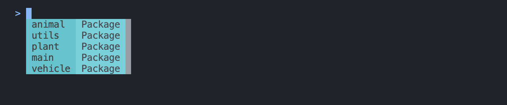
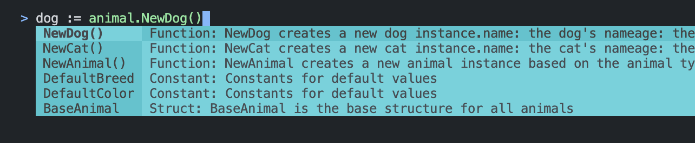
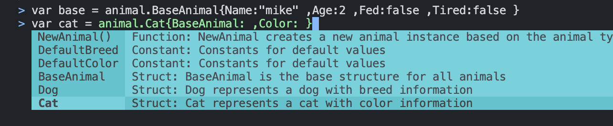
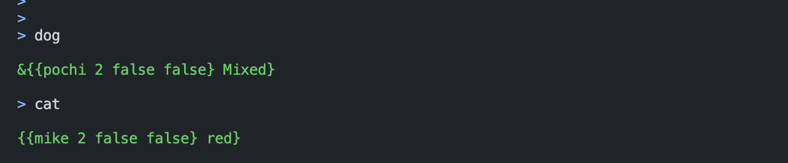
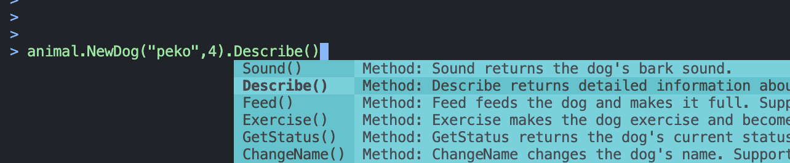
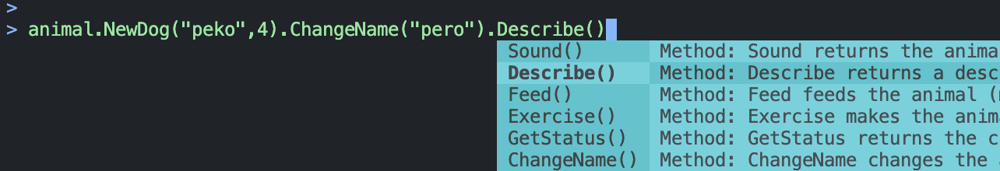
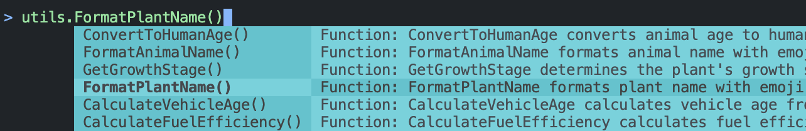
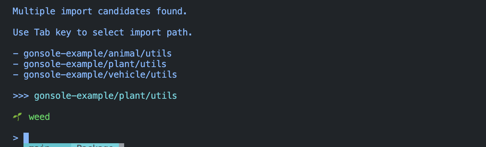

# gonsole

Goプロジェクトの関数やメソッドを、REPL形式で対話的に実行できるCLIツールです。
Ruby on Railsの`rails console`のように、Goコードの関数・変数・構造体・メソッドを即座に試せます。

## 目次

- [特徴](#特徴)
- [インストール](#インストール)
- [使い方（クイックスタート）](#使い方クイックスタート)
  - [起動](#起動)
  - [Goコードの実行](#goコードの実行)
    - [パッケージの選択](#パッケージの選択)
    - [変数定義](#変数定義)
    - [メソッド呼び出し](#メソッド呼び出し)
  - [同名のパッケージ名が存在した場合（importパス選択モード）](#同名のパッケージ名が存在した場合importパス選択モード)
  - [エラー検知](#エラー検知)
- [⚠️現状対応できていないこと](#️現状対応できていないこと)

## 特徴

- Goプロジェクト内の、変数・定数・関数を参照可能
- コンソール内で変数や定数を定義し、それを用いて対話的に関数/メソッドの実行が可能
- 充実した補完機能で、呼び出す関数等のパッケージの選択から式の記述までがスムーズ

## インストール

```sh
go install github.com/kakkky/gonsole/cmd/gonsole@latest
```

または、リポジトリをcloneしてビルド:

```sh
git clone https://github.com/kakkky/gonsole.git
cd gonsole/cmd/gonsole
go build -o gonsole
```

## 使い方（クイックスタート）
この[サンプルプロジェクト](https://github.com/kakkky/gonsole-example)を用いて使い方を説明します。

### 起動
プロジェクトルートで以下を実行:
```sh
gonsole
```
すると、以下のような画面が出てきます。
```
  ____   ___   _   _  ____    ___   _      _____
 / ___| / _ \ | \ | |/ ___|  / _ \ | |    | ____|
| |  _ | | | ||  \| |\___ \ | | | || |    |  _|
| |_| || |_| || |\  | ___) || |_| || |___ | |___
 \____| \___/ |_| \_||____/  \___/ |_____||_____|


 Interactive Golang Execution Console

> 
```

`go mod init`を実行するなど、プロジェクトを初期化していないと起動時にエラーが出ます。

`>`の記号が出ていればgonsoleの起動成功です。この記号に続いてコードを記述し、実行する準備が整ったことを意味します。

また、この時`tmp/gonsolexxxxxxx/main.go`という一時ファイルが生成されます。このファイルはコード実行のために重要なので編集しないようにします。
```
├── tmp
│   └── gonsole784534083
│       └── main.go
```
このファイルは、コンソールの終了（`Ctrl + C`）と共に自動的に削除されます。

### Goコードの実行

#### パッケージの選択
入力に合わせてパッケージの候補が出ます。Tabキーを押して選択しましょう。
今回は`animal`パッケージの要素を呼び出すことにします。




#### 変数定義
メソッド呼び出しや関数の引数に入れるために変数を定義することができます。
以下の関数を呼び出して、`dog`という変数に格納してみましょう。
```go
// NewDog creates a new dog instance.
// name: the dog's name
// age: the dog's age
// Returns: pointer to initialized dog
func NewDog(name string, age int) *Dog {
	return &Dog{
		BaseAnimal: BaseAnimal{
			Name:  name,
			Age:   age,
			Fed:   false,
			Tired: false,
		},
		Breed: DefaultBreed,
	}
}
```

基本的にTabキーを打って選択します。



量が多すぎて絞りたい場合は、例えば`animal.NewD`まで打つと`NewDog`関数のみに絞り込むことができます。

これで定義できました。


`var`による宣言でもOKです。今度は`cat`変数を定義しておきましょう。
構造体リテラルを選択した場合は、フィールドが自動補完されます。



定義した変数を以下のように評価して確認することもできます。変数を入力するのみです。




#### メソッド呼び出し
上で定義した変数`dog`をレシーバとしてメソッドを呼び出してみます。
以下のようにメソッドの候補を選択します。


また、いちいち変数に格納しなくてもメソッドチェーンでも呼び出せます。





### 同名のパッケージ名が存在した場合（importパス選択モード）
サンプルプロジェクトでは、`animal/utils`、`plant/utils`、`vehicle/utils`といったように名前空間で分かれていますが、`utils`パッケージが複数ある状況です。

例えば、`plant/utils`の以下の関数を呼び出したいとしましょう。
```go
// FormatPlantName formats plant name with emoji
func FormatPlantName(name string) string {
	return fmt.Sprintf("🌱 %s", name)
}
```
補完の候補として`utils`パッケージで該当する全ての関数等が出てきます。
Tabキーで移動してEnterで選択してみます。



すると、以下のような表示になります。これは、gonsole側にとりこませるimportパスが競合したことを意味します。


意図するパスをTabキーで選択して確定させましょう。


期待通り呼び出すことができました。




### エラー検知
gonsoleがユーザーにフィードバックするエラーは現状３つあります。

- `BAD INPUT ERROR`
  
基本的にはコード実行の際に起きます。実行した関数の引数が違ったり、返り値の数と代入する数があっていなかったりが起因します。
例えば同名の変数名で再定義し、かつ関数の引数に入れる型を間違えて実行してしまった際に出た例です。

エラーを２つ検知していることがわかります。この場合、２回目に定義しようとした変数`car`はなかったことになります。


- `INTERNAL ERROR`
  
なんらかの原因でgonsoleの内部処理が失敗した時に出るエラーです。基本的にはユーザー起因でないことが多いです。
例えば、gonsole起動時に`go.mod`を見つけられなかった（プロジェクトを初期化していない）場合に起きるエラーです。


- `UNKNOWN ERROR`
  
gonsole側でハンドリングできてないエラーです。
このエラーが出た際はこのリポジトリの[Issues](https://github.com/kakkky/gonsole/issues)に投稿していただけると幸いです。


## ⚠️現状対応できていないこと
- **非公開要素の呼び出し**

    つまり、プライベート関数や型にアクセスすることができません。これは、gonsoleがユーザー側でインストールされているGoの実行エンジンを利用していることに起因します
    直近では、この問題に対応していく意向です。

- **関数またはメソッドが返り値に他パッケージの型を返している場合の適切な補完**

    現状の実装では、他パッケージの型を返す関数を呼び出して変数に格納したとしても、その後の操作で、その変数をレシーバとした適切なメソッド候補を出すことができません。
    というのも、関数やメソッドはそれ自身が定義されているパッケージに属する型を返す想定で実装を行なっているからです。
    この問題は、さらに良い補完体験のために今後対応したいと考えています。

- **コンソール内での関数またはメソッドの宣言**

    こちらは、需要がない限り今後も対応する意向はありません。

- **コンソール内の改行**

    こちらも、需要がない限りは対応しません。基本的にはワンライナーで、簡単に実行できる体験を提供したい所存です。
