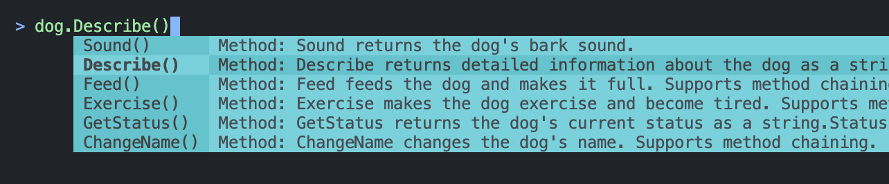
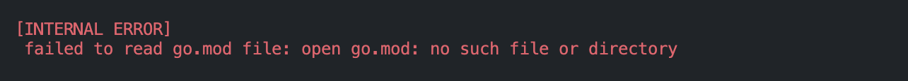

# gonsole

A CLI tool that allows you to interactively execute functions and methods in Go projects in REPL format.
Like Ruby on Rails' `rails console`, you can instantly try Go code functions, variables, structs, and methods.

## Table of Contents

- [Features](#features)
- [Installation](#installation)
- [Usage (Quick Start)](#usage-quick-start)
  - [Startup](#startup)
  - [Executing Go Code](#executing-go-code)
    - [Package Selection](#package-selection)
    - [Variable Definition](#variable-definition)
    - [Method Invocation](#method-invocation)
  - [When Packages with the Same Name Exist (Import Path Selection Mode)](#when-packages-with-the-same-name-exist-import-path-selection-mode)
  - [Error Detection](#error-detection)
- [⚠️Current Limitations](#️current-limitations)

## Features

- Access to variables, constants, and functions within Go projects
- Define variables and constants in the console and use them for interactive function/method execution
- Rich completion features for smooth package selection and expression writing

## Installation

```sh
go install github.com/kakkky/gonsole/cmd/gonsole@latest
```

Or clone the repository and build:

```sh
git clone https://github.com/kakkky/gonsole.git
cd gonsole/cmd/gonsole
go build -o gonsole
```

## Usage (Quick Start)
We'll explain the usage using this [sample project](https://github.com/kakkky/gonsole-example).

### Startup
Execute the following in the project root:
```sh
gonsole
```
You'll see a screen like this:
```sh
  ____   ___   _   _  ____    ___   _      _____
 / ___| / _ \ | \ | |/ ___|  / _ \ | |    | ____|
| |  _ | | | ||  \| |\___ \ | | | || |    |  _|
| |_| || |_| || |\  | ___) || |_| || |___ | |___
 \____| \___/ |_| \_||____/  \___/ |_____||_____|


 Interactive Golang Execution Console

> 
```

If you haven't initialized your project (e.g., by running `go mod init`), you'll get an error at startup.

If the `>` symbol appears, gonsole has started successfully. This symbol indicates that you're ready to write and execute code following it.

At this point, a temporary file `tmp/gonsolexxxxxxx/main.go` is generated. This file is important for code execution, so do not edit it.
```
├── tmp
│   └── gonsole784534083
│       └── main.go
```
This file is automatically deleted when the console exits (`Ctrl + C`).

### Executing Go Code

#### Package Selection
Package candidates appear as you type. Press Tab to select them.
Let's call elements from the `animal` package this time.


#### Variable Definition
You can define variables to use for method calls or function arguments.
Let's call the following function and store it in a variable called `dog`.
```go
// NewDog creates a new dog instance.
// name: the dog's name
// age: the dog's age
// Returns: pointer to initialized dog
func NewDog(name string, age int) *Dog {
	return &Dog{
		BaseAnimal: BaseAnimal{
			Name:  name,
			Age:   age,
			Fed:   false,
			Tired: false,
		},
		Breed: DefaultBreed,
	}
}
```

Basically, press Tab to select.


If there are too many options to narrow down, for example, typing `animal.NewD` will filter to only the `NewDog` function.

This completes the definition.


Declaration with `var` is also OK. Let's define a `cat` variable this time.
When you select a struct literal, fields are auto-completed.


You can also evaluate and check defined variables as follows. Just input the variable.


#### Method Invocation
Let's call a method using the variable `dog` defined above as a receiver.
Select method candidates as follows.




You can also call methods without storing them in variables using method chaining.


### When Packages with the Same Name Exist (Import Path Selection Mode)
In the sample project, there are situations where multiple `utils` packages exist, separated by namespaces like `animal/utils`, `plant/utils`, and `vehicle/utils`.

For example, let's say you want to call the following function from `plant/utils`.
```go
// FormatPlantName formats plant name with emoji
func FormatPlantName(name string) string {
	return fmt.Sprintf("🌱 %s", name)
}
```
All functions from `utils` packages appear as completion candidates.
Navigate with Tab and select with Enter.


You'll see a display like this. This means the import paths have conflicted on the gonsole side.


Select the intended path with Tab and confirm.


It was called as expected.


### Error Detection
Currently, gonsole provides feedback on three types of errors to users.

- `BAD INPUT ERROR`
Basically occurs during code execution. Caused by incorrect function arguments or mismatched numbers of return values and assignments.
For example, here's an error that occurred when trying to redefine a variable with the same name and executing it with the wrong type for function arguments.

You can see that two errors were detected. In this case, the second attempt to define the variable `car` is canceled.


- `INTERNAL ERROR`
An error that occurs when gonsole's internal processing fails for some reason. Usually not caused by the user.
For example, an error that occurs when gonsole cannot find `go.mod` at startup (project not initialized).




- `UNKNOWN ERROR` 
An error that gonsole cannot handle.
If you encounter this error, please post it to the [Issues](https://github.com/kakkky/gonsole/issues) of this repository.


## ⚠️Current Limitations
- **Calling private elements**

    That is, you cannot access private functions or types. This is due to gonsole using the Go execution engine installed on the user side.
    We plan to address this issue in the near future.

- **Proper completion when functions or methods return types from other packages**

    With the current implementation, even if you call a function that returns a type from another package and store it in a variable, you cannot get appropriate method candidates with that variable as a receiver in subsequent operations.
    This is because the implementation assumes that functions and methods return types that belong to the package where they are defined.
    We want to address this issue for a better completion experience in the future.

- **Declaring functions or methods within the console**

    We do not plan to support this in the future unless there is demand.

- **Line breaks within the console**

    We will not support this unless there is demand. We want to provide an experience where you can easily execute basically one-liners.
