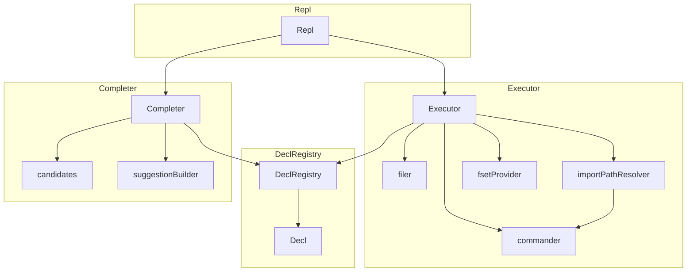

# アーキテクチャ図

# コンポーネント一覧

## Repl
- ユーザーからの入力を受け取り、対話的なコンソール環境を実現する。
- 内部的には、`github.com/kakkky/go-prompt`のラッパーであり、`prompt.Executor`型と`prompt.Completer`型のコールバック関数を受け取る。

## Executor
- goコードの実行を担当するコンポーネント。
- `github.com/kakkky/go-prompt`の`prompt.Executor`型のコールバック関数をメソッドとして持つ構造体

**処理の概要：**
1. input文字列を受け取り、AST解析したものをキャッシュとして保持 
2. 一時ファイルを作成し、ASTキャッシュをファイルに書き込む
3. `go run`コマンドを実行し、一時ファイルのコードを実行
4. 実行結果を標準出力に表示し、一時ファイルを削除する
5. 変数宣言レジストリ(`DeclRegistry`)に宣言情報を登録

また、以下のコンポーネントに内部的に依存している: 

### filer
- ファイル操作を抽象化するインターフェース
    - 一時ファイルの作成処理
    - ASTをファイルに書き込む処理

- テスタビリティのためにインターフェースとして切り出している 

### importPathResolver
- パッケージ名からインポートパスを解決する機能を抽象化するインターフェース
- 内部的には`go list`コマンドを実行し、複数の候補が存在した場合は、ユーザーに選択を促すREPLセッションを開始する
    - コマンド実行の部分は`commander`インターフェースを利用して抽象化している

- テスタビリティのためにインターフェースとして切り出している

### fsetProvider
- `go/token.FileSet`の提供者を抽象化するインターフェース
    - `token.FileSet`は、ソースコード中の位置情報（ファイル名、行番号、カラム番号など）を管理するための構造体であり、ASTの解析やコード生成において各ノードの位置を追跡するために利用されるもの

- テスタビリティのためにインターフェースとして切り出している

### commander
- `go`コマンド実行を抽象化するインターフェース
    - `go list`
    - `go run`

- テスタビリティのためにインターフェースとして切り出している

## Completer
- input文字列から、goコードの補完候補を生成するコンポーネント
- `github.com/kakkky/go-prompt`の`prompt.Completer`型のコールバック関数をメソッドとして持つ構造体

**処理の概要：**
1. input文字列を受け取り、`candidates`コンポーネント & 変数宣言レジストリ(`DeclRegistry`)と照合し、基本的に前方一致する補完候補を抽出
2. 抽出した補完候補をもとに、`suggestionBuilder`コンポーネントを利用して、`go-prompt`の`Suggest`型のスライスを生成
3. 生成した補完候補群を`go-prompt`に返す

また、以下のコンポーネントに内部的に依存している:

### candidates
- `gonsole`プログラムを実行したGoプロジェクトのコードを探索し、補完候補となる要素群を生成して保持するコンポーネント
- 変数、構造体、関数、メソッド、インターフェース、パッケージ名など、様々な要素を補完候補として提供する

### suggestionBuilder
- 確定した補完候補から`go-prompt`の`Suggest`型を生成するコンポーネント
- `Completer`コンポーネントから呼び出される

## DeclRegistry
- 変数宣言の情報を管理するコンポーネント
- コード実行時に`Executor`コンポーネントから呼び出され、REPLセッション中に宣言された変数や関数の情報を登録する
- また、`Completer`コンポーネントから呼び出され、メソッド補完候補の生成に利用される

### Decl
- 変数宣言の情報を表す構造体
- 変数名、型情報、宣言位置、関数の戻り値かどうかなどの情報を保持する
