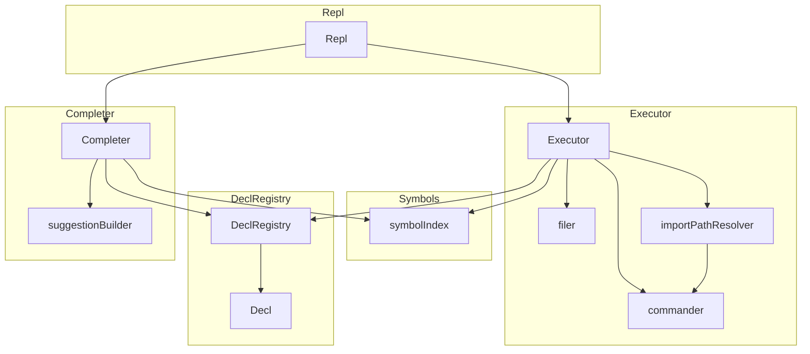

# アーキテクチャ図

```mermaid
graph TD
    subgraph Repl
        REPL[Repl]
    end
    subgraph Symbols
        SYMBOLINDEX[symbolIndex]
    end
    subgraph Executor
        EXEC[Executor]
        FILER[filer]
        IMPORTRESOLVER[importPathResolver]
        COMMANDER[commander]
    end
    subgraph DeclRegistry
        DECLREG[DeclRegistry]
        DECL[Decl]
    end
    subgraph Completer
        COMPLETER[Completer]
        SUGGESTION[suggestionBuilder]
    end

    REPL --> EXEC
    REPL --> COMPLETER
    EXEC --> FILER
    EXEC --> IMPORTRESOLVER
    EXEC --> COMMANDER
    EXEC --> SYMBOLINDEX
    EXEC --> DECLREG
    IMPORTRESOLVER --> COMMANDER
    COMPLETER --> SYMBOLINDEX
    COMPLETER --> SUGGESTION
    COMPLETER --> DECLREG
    DECLREG --> DECL
```

# コンポーネント一覧

## Repl
- ユーザーからの入力を受け取り、対話的なコンソール環境を実現する。
- 内部的には、`github.com/kakkky/go-prompt`のラッパーであり、`prompt.Executor`型と`prompt.Completer`型のコールバック関数を受け取る。

## symbolIndex
- gonsoleプログラムを実行したGoプロジェクトのコードを探索し、要素群を生成して保持するコンポーネント
- 保持する変数、構造体、関数、メソッド、インターフェースは、パッケージ名をキーとしてアクセスできるようになっている

## Executor
- goコードの実行を担当するコンポーネント。
- `github.com/kakkky/go-prompt`の`prompt.Executor`型のコールバック関数をメソッドとして持つ構造体

**処理の概要：**
1. input文字列を受け取り、AST解析したものをキャッシュとして保持 
2. 一時ディレクトリ・一時ファイルを作成し、ASTキャッシュをファイルに書き込む
3. セッション実行用の`go.mod`を動的生成し一時ディレクトリに配置（`pp/v3`を`require`、プロジェクト本体を`replace`でローカル参照）
4. `go mod tidy`を実行して`go.sum`を生成
5. `go run`コマンドを実行し、一時ファイルのコードを実行
6. 実行結果を標準出力に表示する（式文の場合は[`k0kubun/pp`](https://github.com/k0kubun/pp)でフォーマット＆シンタックスハイライト付き出力）
7. 実行後に`go.sum`をクリーンアップし、一時ディレクトリを削除する
8. 変数宣言レジストリ(`DeclRegistry`)に宣言情報を登録

また、以下のコンポーネントに内部的に依存している: 

### filer
- ファイル操作を抽象化するインターフェース
    - 一時ディレクトリの作成処理
    - 一時ファイルの作成処理
    - ASTをファイルに書き込む処理
    - セッション実行用`go.mod`ファイルの生成・配置処理
    - `go.sum`ファイルのクリーンアップ処理

- テスタビリティのためにインターフェースとして切り出している 

### importPathResolver
- パッケージ名からインポートパスを解決する機能を抽象化するインターフェース
- 内部的には`go list`コマンドを実行し、複数の候補が存在した場合は、ユーザーに選択を促すREPLセッションを開始する
    - コマンド実行の部分は`commander`インターフェースを利用して抽象化している

- テスタビリティのためにインターフェースとして切り出している
    
### commander
- `go`コマンド実行を抽象化するインターフェース
    - `go list`
    - `go list -m`（モジュール名の取得）
    - `go run`
    - `go mod tidy`

- テスタビリティのためにインターフェースとして切り出している

## Completer
- input文字列から、goコードの補完候補を生成するコンポーネント
- `github.com/kakkky/go-prompt`の`prompt.Completer`型のコールバック関数をメソッドとして持つ構造体

**処理の概要：**
1. input文字列を受け取り、`symbolIndex`コンポーネント & 変数宣言レジストリ(`DeclRegistry`)と照合し、基本的に前方一致する補完候補を抽出
2. 抽出した補完候補をもとに、`suggestionBuilder`コンポーネントを利用して、`go-prompt`の`Suggest`型のスライスを生成
3. 生成した補完候補群を`go-prompt`に返す

また、以下のコンポーネントに内部的に依存している:

### suggestionBuilder
- 確定した補完候補から`go-prompt`の`Suggest`型を生成するコンポーネント
- `Completer`コンポーネントから呼び出される

## DeclRegistry
- 変数宣言の情報を管理するコンポーネント
- コード実行時に`Executor`コンポーネントから呼び出され、REPLセッション中に宣言された変数や関数の情報を登録する
- また、`Completer`コンポーネントから呼び出され、メソッド補完候補の生成に利用される

### Decl
- 変数宣言の情報を表す構造体
- 変数名、型情報、宣言位置、関数の戻り値かどうかなどの情報を保持する

