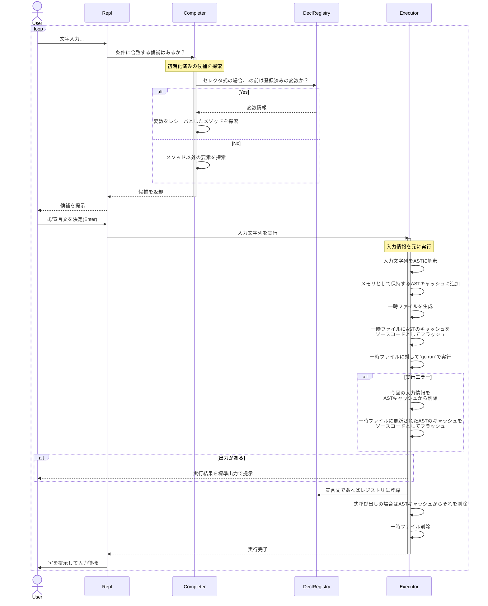

# REPLシーケンス図

```mermaid
sequenceDiagram
    actor User
    participant Repl
    participant Completer
    participant DeclRegistry
    participant Executor

    loop
        User->>Repl: 文字入力...
        Repl->>Completer: 条件に合致する候補はあるか？
        activate Completer
            Note over Completer:初期化済みの候補を探索
            Completer->>DeclRegistry: セレクタ式の場合、.の前は登録済みの変数か？
            alt Yes
                DeclRegistry-->>Completer:変数情報
                Completer->>Completer: 変数をレシーバとしたメソッドを探索
            else No
                Completer->>Completer: メソッド以外の要素を探索
            end
            Completer-->>Repl: 候補を返却
        deactivate Completer

        Repl-->>User: 候補を提示
        User->>Repl: 式/宣言文を決定(Enter)
        Repl->>Executor: 入力文字列を実行
        activate Executor
            Note over Executor: 入力情報を元に実行
            Executor->>Executor: 入力文字列をASTに解釈
            Executor->>Executor: メモリとして保持するASTキャッシュに追加
            Executor->>Executor: 一時ファイルを生成
            Executor->>Executor: 一時ファイルにASTのキャッシュを<br>ソースコードとしてフラッシュ
            Executor->>Executor: 一時ファイルに対して`go run`で実行
            alt 実行エラー
                Executor->>Executor: 今回の入力情報を<br>ASTキャッシュから削除
                Executor->>Executor: 一時ファイルに更新されたASTのキャッシュを<br>ソースコードとしてフラッシュ
            end
            alt 出力がある
                Executor-->>User: 実行結果を標準出力で提示
            end
            Executor->>DeclRegistry: 宣言文であればレジストリに登録
            Executor->>Executor: 式呼び出しの場合はASTキャッシュからそれを削除
            Executor->>Executor:一時ファイル削除
            Executor-->>Repl:実行完了
        deactivate Executor
        Repl->>User: `>`を提示して入力待機
    end
```